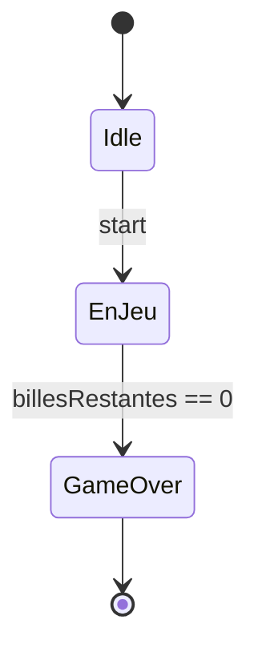

# Diagrammes UML — CDC section 5

## Objectif
Produire 3 diagrammes UML utiles a partir de vos use cases.
Cela correspond a la **section 5 (Diagrammes UML)** de votre CDC technique.

## Consignes

### Diagramme 1 : Use Case UML

Representer les acteurs et les use cases dans un diagramme UML standard.

### Diagramme 2 : Sequence

Prendre 1 use case critique et dessiner le scenario pas a pas.

### Diagramme 3 : Etat

Modeliser le cycle de vie d'un element cle de votre systeme.

## Fichier a modifier

`docs/cdc-technique.md` — section 5

Les fichiers `.puml` ou `.md` (Mermaid) vont dans le dossier `uml/`.

## Livrable
- PR #3 "CDC section 5 : UML v1"

---

## Exemples par projet

### Projet Flipper

**Diagramme 1 — Use Case :**

```
@startuml
left to right direction
actor Joueur as J
actor Admin as A
actor "Systeme (ESP32)" as S

rectangle Flipper {
  usecase "Lancer une partie" as UC1
  usecase "Connecter controleur" as UC2
  usecase "Consulter scores" as UC3
  usecase "Configurer table" as UC4
  usecase "Synchroniser ecrans" as UC5
  usecase "Sauvegarder partie" as UC6
}

J --> UC1
J --> UC2
J --> UC3
J --> UC6
A --> UC4
S --> UC5
S --> UC2
@enduml
```

**Diagramme 2 — Sequence "Lancer une partie" :**

```
@startuml
actor Joueur as J
participant "UI Web" as UI
participant "Serveur WS" as WS
participant "Moteur Physique\n(Cannon.js)" as PH
participant "ESP32" as ESP

J -> UI : clic "Nouvelle partie"
UI -> WS : startGame()
WS -> PH : resetTable()
PH --> WS : tableReady
WS -> UI : afficher "Ready"
WS -> ESP : setLED("ready")
J -> UI : actionne lanceur
UI -> WS : launchBall(force)
WS -> PH : applyForce(ball, force)
PH --> WS : ballPosition(x,y)
WS -> UI : render(ball)
@enduml
```

**Diagramme 3 — Etat d'une partie :**

```
@startuml
[*] --> Idle
Idle --> Calibration : startGame
Calibration --> Ready : tableReady
Ready --> EnJeu : launchBall
EnJeu --> BillePerdue : ballDrain
BillePerdue --> EnJeu : billesRestantes > 0
BillePerdue --> GameOver : billesRestantes == 0
GameOver --> Idle : reset
GameOver --> [*]
@enduml
```

---

### Projet Robotique

**Diagramme 1 — Use Case :**

```
@startuml
left to right direction
actor Operateur as O
actor "Robot (autonome)" as R

rectangle "Robot Assistance" {
  usecase "Naviguer vers un point" as UC1
  usecase "Saisir un objet" as UC2
  usecase "Piloter manuellement" as UC3
  usecase "Cartographier" as UC4
  usecase "Surveiller etat" as UC5
  usecase "Eviter obstacle" as UC6
}

O --> UC3
O --> UC5
O --> UC1
R --> UC1
R --> UC2
R --> UC4
R --> UC6
@enduml
```

**Diagramme 2 — Sequence "Saisir un objet" :**

```
@startuml
actor Operateur as O
participant "Dashboard Web" as UI
participant "ROS 2 Core" as ROS
participant "Camera\nRealSense" as CAM
participant "Bras\nRobotique" as ARM
participant "Navigation\nSLAM" as NAV

O -> UI : designe objet sur camera
UI -> ROS : targetObject(x, y)
ROS -> CAM : getDepth(x, y)
CAM --> ROS : position3D(X, Y, Z)
ROS -> NAV : navigateTo(X, Y)
NAV --> ROS : arrived
ROS -> ARM : moveTo(X, Y, Z)
ARM --> ROS : positioned
ROS -> ARM : grip()
ARM --> ROS : objectGripped
ROS -> UI : status("Objet saisi")
@enduml
```

**Diagramme 3 — Etat du robot :**

```
@startuml
[*] --> Veille
Veille --> Initialisation : powerOn
Initialisation --> Pret : sensorsOK
Pret --> Navigation : goTo(destination)
Pret --> PilotageManuel : manualMode
Navigation --> Pret : arrived
Navigation --> Evitement : obstacleDetected
Evitement --> Navigation : pathClear
PilotageManuel --> Pret : autoMode
Pret --> Saisie : graspObject
Saisie --> Pret : objectGripped
Saisie --> Pret : graspFailed(maxRetries)
Pret --> Veille : sleep
@enduml
```

---

## Outils
- **Mermaid** : directement dans les `.md` (GitHub le rend)
- **PlantUML** : fichiers `.puml` dans `uml/`
- **draw.io** : export en `.png` dans `uml/`

## Fichiers a creer

```
uml/use-case-diagram.puml (ou .md avec mermaid)
uml/sequence-uc01.puml
uml/state-diagram.puml
```

## Aide

### Mermaid dans un fichier .md

````markdown

````

### PlantUML en ligne
- https://www.plantuml.com/plantuml/uml/
- Coller le code, copier l'image ou le lien

### Astuces
- Ne cherchez pas la perfection graphique
- Un diagramme utile > un diagramme joli
- Si le diagramme n'aide pas a comprendre le systeme, il est inutile
