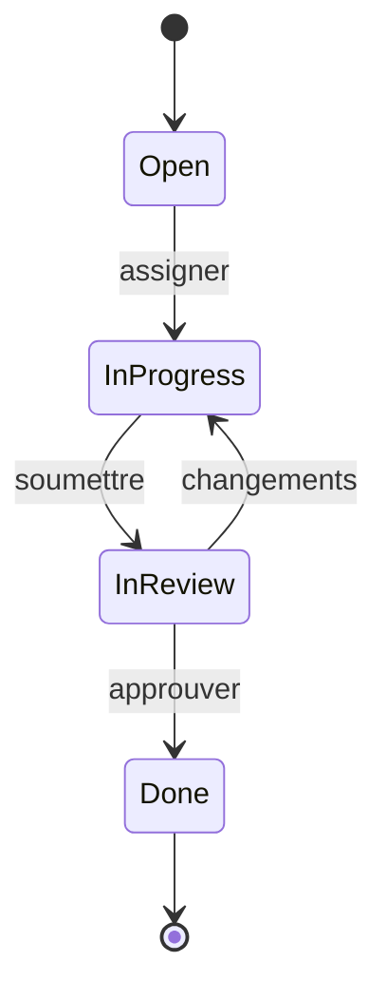

# Diagrammes UML NerdTickets

## Objectif
Produire 3 diagrammes UML utiles a partir de vos use cases.

## Consignes

### Diagramme 1 : Use Case UML

Representer les acteurs et les use cases dans un diagramme UML standard.

Format Mermaid ou PlantUML :

```
@startuml
left to right direction
actor Utilisateur as U
actor Admin as A

rectangle NerdTickets {
  usecase "Creer un ticket" as UC1
  usecase "Assigner un ticket" as UC2
  usecase "Changer statut" as UC3
  usecase "Commenter" as UC4
  usecase "Exporter recap" as UC5
}

U --> UC1
U --> UC2
U --> UC3
U --> UC4
A --> UC5
@enduml
```

### Diagramme 2 : Sequence

Prendre 1 use case critique et dessiner le scenario pas a pas.

```
@startuml
actor Utilisateur as U
participant "UI" as UI
participant "API" as API
participant "DB" as DB

U -> UI : clique "Nouveau ticket"
UI -> API : POST /tickets
API -> DB : INSERT ticket
DB --> API : ticket cree
API --> UI : 201 Created
UI --> U : affiche ticket
@enduml
```

### Diagramme 3 : Etat du ticket

Modeliser le cycle de vie d'un ticket :

```
@startuml
[*] --> Open
Open --> InProgress : assigner
InProgress --> InReview : soumettre
InReview --> Done : approuver
InReview --> InProgress : demander changements
Done --> [*]
Open --> Cancelled : annuler
InProgress --> Cancelled : annuler
@enduml
```

## Outils
- **Mermaid** : directement dans les `.md` (GitHub le rend)
- **PlantUML** : fichiers `.puml` dans `/uml/`
- **draw.io** : export en `.png` dans `/uml/`

## Fichiers a creer

```
uml/use-case-diagram.puml (ou .md avec mermaid)
uml/sequence-uc01.puml
uml/ticket-state.puml
```

## Livrable
- PR #3 "UML v1"

## Aide

### Mermaid dans un fichier .md

````markdown

````

### PlantUML en ligne
- https://www.plantuml.com/plantuml/uml/
- Coller le code, copier l'image ou le lien

### Astuces
- Ne cherchez pas la perfection graphique
- Un diagramme utile > un diagramme joli
- Si le diagramme n'aide pas a comprendre le use case, il est inutile
